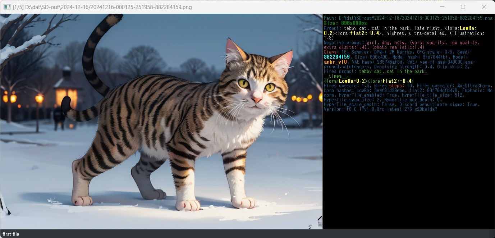
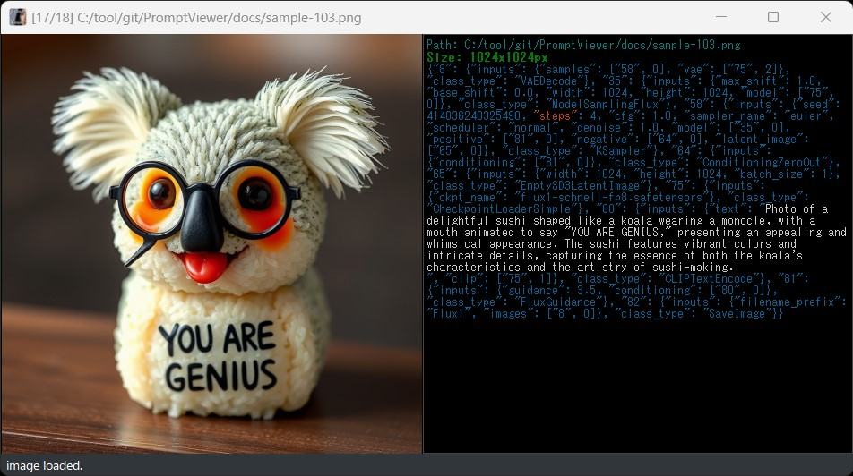
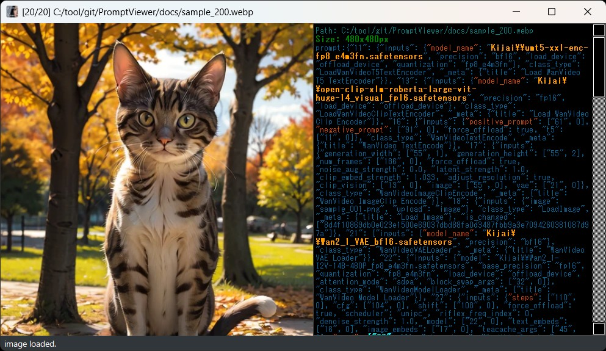

## About PromptViewer 0.2.7
The PromptViewer is a tool that allows you to check the prompt information of images created by StableDiffusion while sorting them to the specified folder “one-handed”.  
It works with mouse or keyboard.  
Supports jpg, png, webp, avif file or zip files of images  

## Features
- Complete checking of images and prompts with one-hand operation
- Copy Prompt information and Seed number to support re-generating images  
- Sorting of images by liking or needing modification  
- Simple and fast (that's what we're aiming for)  

## How to install (simple)
[Download the simple installation version zip].  
    https://github.com/nekotodance/PromptViewer/releases/download/latest/PromptViewer.zip  

> [!TIP]
> If you are still not sure how to install it after reading the following...  
> If you are not sure how to install it after reading the following, or if you want to modify it a little to make it work the way you like, please take a look at this page (in Japanese only)  
> https://www.youtube.com/watch?v=6_ijw0X4_mo

- Install Python (SD standard 3.10.6 recommended)  
- Extract the zip file  
- Right-click “pv-install.ps1” in the extracted folder and select “Run with PowerShell  
> [!WARNING]
> Shell scripts are not configured to work by default!  
> In that case, run the terminal as an administrator and execute the following command (relatively secure method)  
> Set-ExecutionPolicy Unrestricted -Scope CurrentUser -Force

- At the end of the install, it will ask if you want to copy the link to your desktop  
At the end of the install, it will ask if you want to copy the link to your desktop.  
Type “y” if you want to, or just press “enter”.  
If not necessary, type “n” and press “enter  
- A PromptViewer link will be created.
- Change settings  
> [!WARNING]
> See “About configuration files” and change image-fcopy-dir and image-fmove-dir!  

## How to install (manually)
- Install Python (SD standard 3.10.6 recommended)  
- Install git  
- Get repository with git  
    git clone https://github.com/nekotodance/PromptViewer
- Required libraries  
    pip install PyQt5 pyperclip Image piexif pillow-avif-plugin
- How to run  
    Python PromptViewer.py

## About the settings file
PromptViewer_settings.json holds the following information  

- Setting the destination directory for copying and moving
  - image-fcopy-dir : W, the name of the folder to which files are copied using the up key  
  - image-fmove-dir : Name of the folder to which files are moved by pressing the S, down key (note that this is a file move).  
> [!CAUTION]
> Please rewrite image-fcopy-dir and image-fmove-dir [be sure to rewrite them according to your own environment]!  
> Also, the path delimiter should be written as “W:/_temp/ai”, not “W:\\_temp\ai” in Windows!  

- Screen Display Settings
  - info-label-w : Width of Prompt display area (default value: 480)  
  - geometry-x,y : last window position  
  - geometry-w,h : last window size  

- sound effect settings (you can change the WAVE file to anything you like, though I haven't tried it)  
  - sound-beep : Error on when processing fails  
  - sound-fcopy-ok : sound when copying succeeds  
  - sound-fmove-ok : sound when move succeeded  
  - sound-f-cansel : sound when copy or move is canceled  
  - sound-move-top : sound when the next image is displayed and the image goes back to the first image.  
  - sound-move-end : sound when the previous image is displayed and the user goes back to the last image.  

## How to use
Drag and drop an image file (JPG or PNG file), a folder containing image files, or a zip file containing compressed image files onto the application.  
Drag & drop on the link file itself will also work.  
It also works by specifying the file or folder as an argument when executing Python.  

#### Key operations (if you want to change the assignments, rewrite the key event processing in the source as you like)
AD, Left/Right : Move to the next/previous image in the same folder  
ZC,PageUp/Down : Skip movement by 10 files
Q,ESC : Exit  
0,1,2 : Fit the image to 0:1/2, 1:Equal, 2:2 times the image size (toggle operation)  
F,Enter : Switch to full screen display (toggle action)  
W,Top : Copies the displayed image to the folder specified by “image-fcopy-dir” in the configuration file *2  
S,Down : Move the displayed image to the folder specified by “image-fmove-dir” in the configuration file *3  
K : Seed number to copy buffer *4  
P : Prompt string to copy buffer *4  
N : Negative Prompt string to copy buffer *4  
H : Hires Prompt string to copy buffer *4  
I : Toggle between displaying and not displaying Prompt information display (toggle operation)

#### Mouse operation
Wheel operation : Move to the next/previous image in the same folder  
Right click : Copy the displayed image to the folder specified by image-fcopy-dir in the configuration file *2  
Double left click : Toggle full screen display (toggle operation)  
Left drag : Move the window  

2: Copying can be canceled (deleted from the destination) by pressing the key again.  
3:Move can be canceled by pressing the key again (only possible if the image has not been moved).  
    However, the move process is not performed while referencing the zip file.  
4:The ComfyUI output file is copied to the copy buffer in its entirety, including workflow information.  

## Screen display contents
Prompt display image for Forge and A1111  

#### Window Title
[number of currently displayed image/total number of images in the same folder] Full path file name  

#### Prompt Info
Display the text in different colors and thicknesses as follows
- Gray : Prompt  
- Purple : Negative Prompt  
- Green : Hires Prompt  
- Yellow Bold : Lora Name  
- Light blue bold : Seed number  
- Bold orange : Model name  
- Orange : Colorize text ADetailer prompt, Steps:, steps:  

*ComfyUI is only partially supported as it varies greatly depending on the node used  
If necessary, modify the source (“Highlighted keywords for ComfyUI” in PromptViewer.py) to suit your personal usage environment.  

#### Status Bar
Display of operation status

## Misc.
I created a 0.2.2-based function to turn on/off the prompt information display part as a trial.  
If you are interested, please feel free to learn how to program it.  
(I don't intend to incorporate it into the main program, as there are plenty of other excellent image viewers out there.)  
https://github.com/nekotodance/PromptViewer/blob/main/docs/PromptViewer-0.2.2base-toggle_InfoText.py
-> I implemented it in 0.2.3.

## Notes
- We have checked the display in the output files of Automatic1111, Forge, reForge, and ComfyUI.  
(However, we do not guarantee the operation of ComfyUI, as its Prompt output differs depending on the node.)  
- AVIF is only available for Automatic1111 output files.  
- Currently, in the case of png files, line feed codes in the Prompt information are not picked up properly; there may be a problem in the use of the Image library or in the specification of character encoding.  
- ComfyUI does not support copying or coloring of Prompt information.  

## Changelog
- 0.2.7 Changed processing method of highlighting for ComfyUI, added keywords, etc
- 0.2.6 Correspondence to garbled characters in zip files (Windows only)
- 0.2.5 Add highlighted keywords, etc
- 0.2.4 ComfyUI-like files can be copied in their entirety, including workflow, with the P key.  
- 0.2.3 Webp animation support (tentative), prompt information display on/off  
- 0.2.2 Minor modifications, changed the judgment method because there was a sense of discomfort with the 0, 1, and 2 keys, and added Ctrl key combination operation.  
- 0.2.1 Minor modifications, added reference to a beginner's installation and customization video (in Japanese)  
- 0.2.0 Support for drag-drop of zip files, support for skip movement with ZC key, etc  
- 0.1.9 Added Prompt emphasis for ComfyUI files, etc  
- 0.1.8 Corrected the method of determining ComfyUI files  
- 0.1.7 App icon settings  
- 0.1.6 Added support for displaying avif files, revised readme  
- 0.1.5 Fixed wrong image size when displaying equal size, 2x, 1/2x, and resizing window  
- 0.1.4 No functional changes, added comments to make customizing keys and functions easier  
- 0.1.3 Added support for displaying webp files after jpg and png  
- 0.1.2 Added support for text coloring and line breaks in PNG files generated by ComfyUI (tentative)  
- 0.1.1.1 When exiting while in full screen mode, exit after canceling full screen mode (to avoid saving strange screen sizes)  
- 0.1.0 Various fixes, but this is the first version  

That's all.
