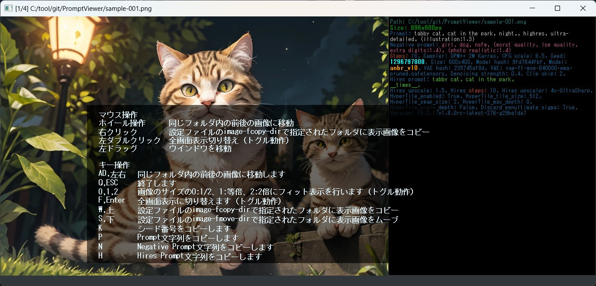

## PromptViewerについて
StableDiffusionで作成した画像のプロンプト情報を確認しながら、指定フォルダへの振り分けを
簡易に行うのを目的としたツールです  

## インストール方法
インストールフォルダをC:\tool\git\PromptViewerとした場合で説明  
！Pythonはインストールされていて最低限の知識はあるものとします！  

#### 1)C:\tool\git\PromptViewerを作成
#### 2)以下のファイルを格納
  PromptViewer.py  
  PromptViewer_beep.wav  
  PromptViewer_filecansel.wav  
  PromptViewer_filecopyok.wav  
  PromptViewer_filemoveok.wav  
  PromptViewer_moveend.wav  
  PromptViewer_movetop.wav  
  pvsubfunc.py  
  
  PromptViewer_settings.json    ※1

※1:設定ファイルはなければ自動で作成されるのでなくても良い
  
#### 3)コマンドプロンプトを立ち上げて以下を実行する。この手順はインストールの一度のみ
###### 3-1)カレントフォルダの移動移動
    c:
    cd C:\tool\git\PromptViewer
###### 3-2)venv環境を作成、activate
    py -m venv venv
    .\venv\Scripts\activate.bat
###### 3-3)利用するライブラリをインストール
    pip install PyQt5 pyperclip Image
###### 3-4)動作確認
    py PromptViewer.py
    
###### 3-5)設定の変更
！「設定ファイルについて」を参照し、image-fcopy-dir、image-fmove-dirを変更のこと！

#### 4)起動に便利なショートカットの作成
  適当なフォルダで右クリックして「新規作成」->「ショートカット」  
「項目の場所を...」に以下を入力
  C:\tool\git\PromptViewer\Scripts\pythonw.exe C:\tool\git\PromptViewer\PromptViewer.py  
  
  今後は作成したショートカットをダブルクリックでアプリのように使えます  

## 設定ファイルについて
PromptViewer_settings.jsonに以下の情報を保持しています  
！特にimage-fcopy-dir、image-fmove-dirは【自分の環境に合わせて必ず】書き換えてください！  

image-fcopy-dir   : W,上キーによるファイルのコピー先フォルダ名  
image-fmove-dir   : S,下キーによるファイルのムーブ先フォルダ名（こちらはファイルの移動となるので注意）  

info-label-w      : Prompt表示領域の横幅(デフォルト値:480)  
geometry-x,y      : 最後のウインドウ表示位置  
geometry-w,h      : 最後のウインドウ表示サイズ  

以下は効果音となります（WAVEファイルで好きなものに変更可能です、たぶん）  
sound-beep        : 処理失敗時のエラーオン  
sound-fcopy-ok    : コピー成功時の音  
sound-fmove-ok    : ムーブ成功時の音  
sound-f-cansel    : コピー、ムーブのキャンセル時の音  
sound-move-top    : 次の画像表示時に、一廻りして最初の画像に戻った時の音  
sound-move-end    : 前の画像表示時に、一廻りして最後の画像に戻った時の音  

## 利用方法
アプリ上に画像ファイル（JPGかPNGファイル）、もしくは画像ファイルが入ったフォルダをドラッグ＆ドロップしてください

## キー操作（割当を変えたい人はソースのキーイベント処理を好きに書き換えてください）
AD,左右   : 同じフォルダ内の前後の画像に移動  
Q,ESC     : 終了  
0,1,2     : 画像のサイズの0:1/2、1:等倍、2:2倍にフィット表示（トグル動作）  
F,Enter   : 全画面表示に切り替え（トグル動作）  
W,上      : 設定ファイルのimage-fcopy-dirで指定されたフォルダに表示画像をコピー ※2  
S,下      : 設定ファイルのimage-fmove-dirで指定されたフォルダに表示画像をムーブ ※3  
K         : シード番号をコピーバッファへ  
P         : Prompt文字列をコピーバッファへ  
N         : Negative Prompt文字列をコピーバッファへ  
H         : Hires Prompt文字列をコピーバッファへ  

## マウス操作
ホイール操作      : 同じフォルダ内の前後の画像に移動  
右クリック        : 設定ファイルのimage-fcopy-dirで指定されたフォルダに表示画像をコピー  
左ダブルクリック  : 全画面表示切り替え（トグル動作）  
左ドラッグ       :  ウインドウを移動  

※2:コピーは再度キーを押すことでキャンセル（コピー先から削除）出来ます  
※3:ムーブは再度キーを押すことで取り消し出来ます（画像から移動していない場合のみ可能）  

## 注意事項
・Automatic1111かForgeの出力ファイルでしか確認していません。  
・現状はPrompt情報の改行コードがうまく拾えていません。Imageライブラリの利用方法か、文字コードの指定に問題があるかもしれません。  
・一応jpgファイルも表示できますが、自作のツールでのPrompt情報をExifタグコメントかjpgコメント部分にコピーしたものでしか動作確認していません。またその際、現物に合わせた改行コードの置換を行っています。

以上
