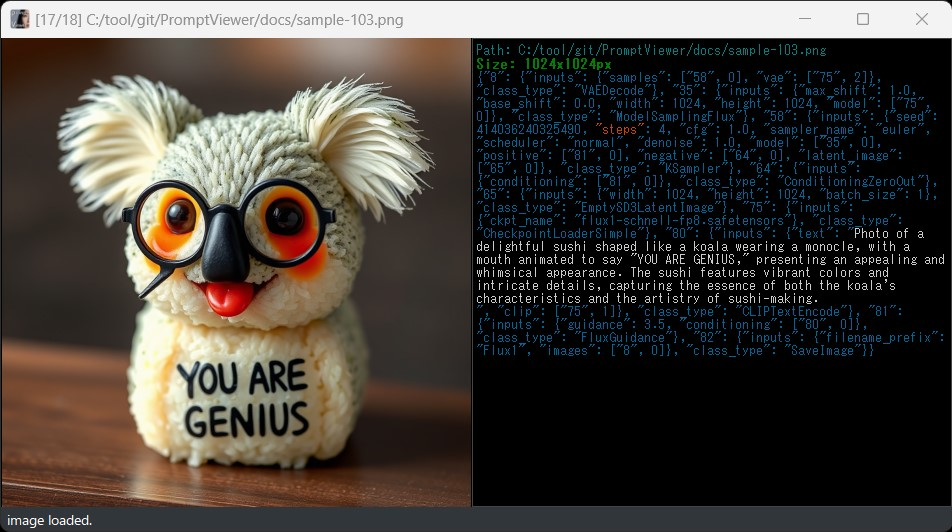

[README in English](readme-en.md)

## PromptViewerについて 0.2.4
StableDiffusionで作成した画像のプロンプト情報を確認しながら、指定フォルダへの振り分けを「片手」で行うのを目的としたツールです  
マウスもしくはキーボードで動作します  
jpg, png, webp, avifファイル、もしくは画像のzipファイルをサポートしています  

## 特徴
- 画像とプロンプトのチェックを片手操作で完結
- Prompt情報やSeed番号のコピー機能により、画像の再生成を支援  
- 気に入った、修正が必要などの画像振り分け  
- とにかくシンプルで高速（を目指してます）  

## インストール方法（簡易）
[簡易インストール版zipのダウンロード]  
    https://github.com/nekotodance/PromptViewer/releases/download/latest/PromptViewer.zip  

> [!TIP]
> 下記を読んでもインストールの方法が良く分からない  
> もしくは少し修正して自分好みの動作にしてみたい方は御覧ください  
> https://www.youtube.com/watch?v=6_ijw0X4_mo

- Pythonのインストール（SD標準の3.10.6推奨）  
- zipファイルを解凍  
- 解凍したフォルダ内の「pv-install.ps1」を右クリックして「PowerShellで実行」を選択  
> [!WARNING]
> シェルスクリプトはデフォルトでは動作しない設定となっています  
> その場合はターミナルを管理者として実行し、以下のコマンドを実行してください（比較的安全な方式）  
> Set-ExecutionPolicy Unrestricted -Scope CurrentUser -Force

- イントールの最後にデスクトップにリンクをコピーするかどうかを聞いてきます  
「"Do you want to copy the shortcut to your desktop? (y or enter/n)」  
必要があれば「y」入力後、もしくはそのまま「enter」キー  
必要なければ「n」入力後「enter」キー  
- PromptViewerリンクが作成されます
- 設定の変更  
> [!WARNING]
> 「設定ファイルについて」を参照し、image-fcopy-dir、image-fmove-dirを変更のこと！  

## インストール方法（手動）
- Pythonのインストール（SD標準の3.10.6推奨）  
- gitのインストール  
- gitでリポジトリを取得  
    git clone https://github.com/nekotodance/PromptViewer
- 必要なライブラリ  
    pip install PyQt5 pyperclip Image piexif pillow-avif-plugin
- 実行方法  
    Python PromptViewer.py

## 設定ファイルについて
PromptViewer_settings.jsonに以下の情報を保持しています  

- コピー、ムーブ先のディレクトリ設定
  - image-fcopy-dir   : W,上キーによるファイルのコピー先フォルダ名  
  - image-fmove-dir   : S,下キーによるファイルのムーブ先フォルダ名（こちらはファイルの移動となるので注意）  
> [!CAUTION]
> image-fcopy-dir、image-fmove-dirは【自分の環境に合わせて必ず】書き換えてください！  
> またパスの区切り文字は、ウインドウズの「W:\\_temp\\ai」ではなく「W:/_temp/ai」として記載してください  

- 画面の表示に関する設定
  - info-label-w      : Prompt表示領域の横幅(デフォルト値:480)  
  - geometry-x,y      : 最後のウインドウ表示位置  
  - geometry-w,h      : 最後のウインドウ表示サイズ  

- 効果音設定（WAVEファイルを好きなものに変更可能です、試してませんが）  
  - sound-beep        : 処理失敗時のエラーオン  
  - sound-fcopy-ok    : コピー成功時の音  
  - sound-fmove-ok    : ムーブ成功時の音  
  - sound-f-cansel    : コピー、ムーブのキャンセル時の音  
  - sound-move-top    : 次の画像表示時に、一廻りして最初の画像に戻った時の音  
  - sound-move-end    : 前の画像表示時に、一廻りして最後の画像に戻った時の音  

## 利用方法
アプリ上に画像ファイル（JPGかPNGファイル）もしくは画像ファイルが入ったフォルダ、画像ファイルを圧縮したzipファイルをドラッグ＆ドロップしてください  
※リンクファイル自体へのドラッグ＆ドロップでも動作します  
※Python実行時の引数にファイルやフォルダを指定することでも動作します  

#### キー操作（割当を変えたい人はソースのキーイベント処理を好きに書き換えてください）
AD,左右   : 同じフォルダ内の前後の画像に移動  
ZC,PageUp/Down : 10ファイル単位のスキップ移動  
Q,ESC     : 終了  
0,1,2     : 画像のサイズの0:1/2、1:等倍、2:2倍にフィット表示（トグル動作）  
F,Enter   : 全画面表示に切り替え（トグル動作）  
W,上      : 設定ファイルのimage-fcopy-dirで指定されたフォルダに表示画像をコピー ※2  
S,下      : 設定ファイルのimage-fmove-dirで指定されたフォルダに表示画像をムーブ ※3  
K         : シード番号をコピーバッファへ ※4  
P         : Prompt文字列をコピーバッファへ ※4  
N         : Negative Prompt文字列をコピーバッファへ ※4  
H         : Hires Prompt文字列をコピーバッファへ ※4  
I         : Prompt情報表示の表示・非表示切り替え（トグル動作）  

#### マウス操作
ホイール操作      : 同じフォルダ内の前後の画像に移動  
右クリック        : 設定ファイルのimage-fcopy-dirで指定されたフォルダに表示画像をコピー ※2  
左ダブルクリック  : 全画面表示切り替え（トグル動作）  
左ドラッグ       :  ウインドウを移動  

※2:コピーは再度キーを押すことでキャンセル（コピー先から削除）出来ます  
※3:ムーブは再度キーを押すことで取り消し出来ます（画像から移動していない場合のみ可能）  
    ただしzipファイル参照中はムーブ処理は行われません  
※4:ComfyUIの出力ファイルはワークフロー情報なんかも混みでまるごとコピーバッファへ  

## 画面の表示内容
ForgeやA1111の場合のPrompt表示イメージ  

#### Window Title
[現在表示中の画像番号/同一フォルダ（もしくはzipファイル）内の画像総数] フルパスのファイル名  

#### Prompt Info
以下のように文字の色や太さを変えて表示
- 灰色 : Prompt  
- 紫色 : Negative Prompt  
- 緑色 : Hires Prompt  
- 黄色太 : Lora名  
- 水色太 : Seed番号  
- 橙色太 : Model名  
- 橙色 : 文字を着色 ADetailer prompt、Steps:、steps:  

※ComfyUIの出力ファイルには部分的にしか対応していません  
ComfyUIの場合のPrompt表示イメージ  

#### Status Bar
動作状況の表示

## その他
試しにプロンプト情報表示部分をオン・オフする機能を0.2.2ベースで作成しました  
興味があればプログラムの勉強がてらにどうぞ  
（他に優れた画像ビューアはいくらでもあるので本筋に組み込む気はないですが）  
https://github.com/nekotodance/PromptViewer/blob/main/docs/PromptViewer-0.2.2base-toggle_InfoText.py  
-> 0.2.3で実装してしまいました

## 注意事項
- Automatic1111、Forge、reForge、ComfyUIの出力ファイルで表示を確認しています  
（ただしComfyUIはノードによりPrompt出力内容が異なるため動作は保証しません）  
- AVIFはAutomatic1111の出力ファイルでのみ表示を確認しています  
- 現状はpngファイルの場合、Prompt情報の中の改行コードがうまく拾えていません。Imageライブラリの利用方法か、文字コードの指定に問題があるかもしれません  
- ComfyUIのPrompt情報のコピーや色付けには対応していません  

## 変更履歴
- 0.2.4 ComfyUIっぽいファイルはPキーでワークフローも込みで丸ごとコピー可能に変更  
- 0.2.3 Webpアニメーション対応（暫定）、プロンプト情報表示オンオフ対応  
- 0.2.2 軽微な修正、0,1,2キーでの操作に違和感があったので判定方法を変更、Ctrlキー併用動作を追加  
- 0.2.1 軽微な修正、初心者用インストール兼カスタマイズ方法動画の参照追加  
- 0.2.0 zipファイルのドラッグドロップに対応、ZCPageUp/Downキーでのスキップ移動対応など  
- 0.1.9 ComfyUIファイルのPrompt強調を追加など  
- 0.1.8 ComfyUIファイルの判定方法を修正  
- 0.1.7 アプリアイコンの設定  
- 0.1.6 avifファイルの表示に対応、readmeの見直し  
- 0.1.5 等倍、2倍、1/2倍表示、ウインドウサイズ変更時に画像サイズが間違っていたのを修正  
- 0.1.4 機能的には変更なし、キーや機能のカスタマイズが楽になるようなコメントを追記  
- 0.1.3 jpg,pngに続きwebpファイルの表示に対応  
- 0.1.2 ComfyUIで生成したPNGファイルのtext部分の色付けと改行に対応（暫定的）  
- 0.1.1 全画面中に終了した場合に、全画面を解除してから終了（変な画面サイズを保存しないため）  
- 0.1.0 色々修正してますがいったん初版  

以上
